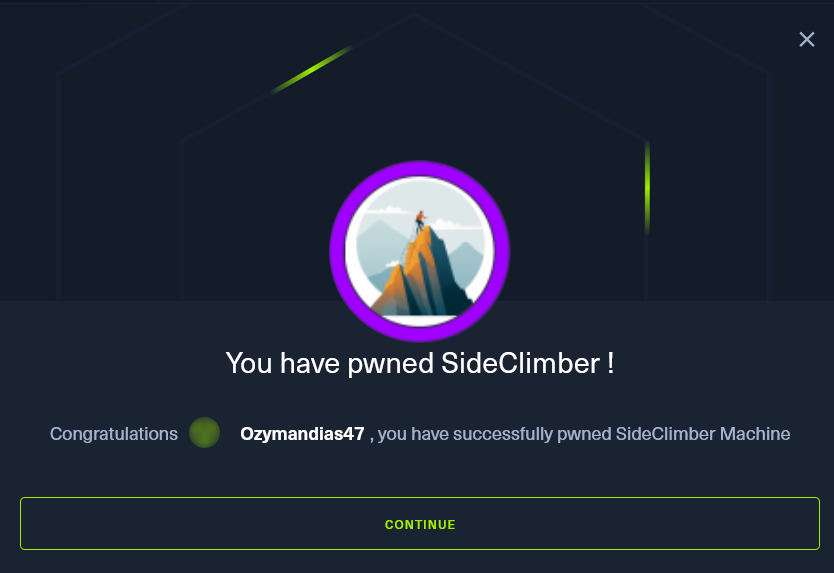

# Machine: Side Climber

sudo openvpn <file> 

## Machine Description

SideClimber is a very easy Linux machine that showcases a common `session puzzling`  / business logic vulnerability. A task is given to purchase two items for the price of one. The subtotal amount is only updated in the user's session when the checkout page is loaded, which makes it possible to add more items to the cart from a separate tab before finalizing the order without their price being added to the sum, resulting in the purchase of multiple items for a reduced price.

The machine falls under the category of Business Logic vulnerabilities, presenting a task to the user. 

Complete the task below to gain access to the flag.

**Task:** Purchase a Full Zip Hoodie and a Mens Sherpa Hoodie for $779.55

**Area of Interest**

Web Application, Custom Applications, Session Management and Hijacking, Vulnerability Assessment, Common Security Controls

**Technology**

NGINX

**Vulnerabilities**

Business Logic

**Languages**

PHP

**Techniques**

Session Puzzling

**QUESTION 1**

What open source software is running on port 80? Provide the name without the version.

1. Let’s connect to HTB lab via openvpn by downloading a vpn file from HTB, navigating to that file on kali and let’s connect using `sudo openvpn <filename>`
2. We’re looking for software running on port 80 so lets try and nmap service scan using the `-sV`option. 

Our nmap scan reveals nginx 1.18.0 running on port 80. 

**QUESTION 2**

Which item costs $779.55?

1. Lets open this ip in firefox. 
2. In mens section ‘Mens Sherpa Hoodie’ is priced for $779.55

**QUESTION 3**

Does the counter next to the top right icon increase when a new product is added to the cart from the current browser tab?

1. Let’s add some products and test this… 

1. Yes! 

**QUESTION 4**

Does the counter next to the top right icon in the current tab increase when a new product is added to the cart from another tab?

1. No it does not. 

**QUESTION 5**

After reaching checkout, is the total amount shown in the order summary affected by products added to the cart from a different tab?

1. Let’s add a product from a different tab into the cart and see if it affects the first tab. 
2. If we add a product from a separate tab right before we do the last stage of the check out, it adds the product without affecting the price! 

ROOT FLAG

**Enter the root flag**

